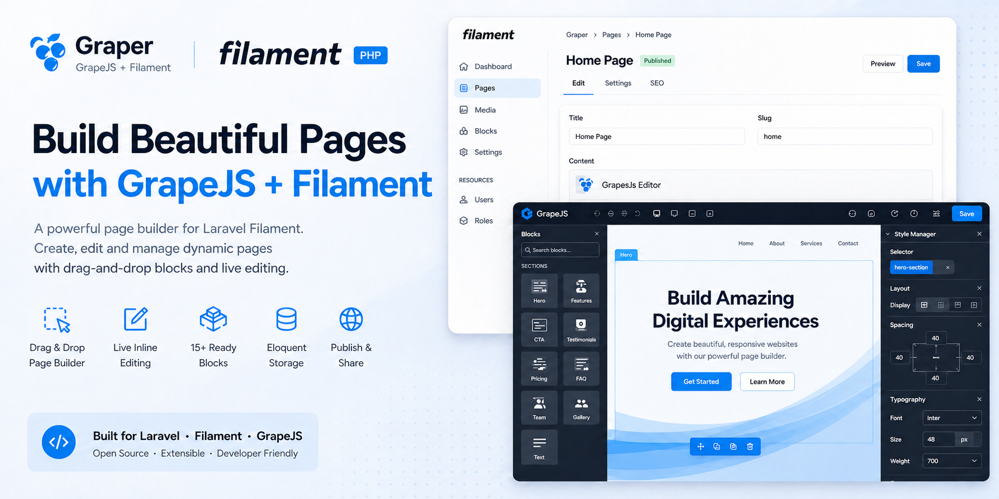

# GrapeJS Page Builder for Filament

[](https://packagist.org/packages/cybertroniankelvin/graper)
[](https://packagist.org/packages/cybertroniankelvin/graper)

A visual page builder plugin for Filament that uses GrapeJS v3 to let admins create and edit pages with a drag-and-drop interface.



## How to Use This Plugin

### 1. Installation & Setup

In a Laravel/Filament app:

```bash
# Install the package
composer require cybertroniankelvin/graper

# Run migrations
php artisan migrate

# Publish config/views if needed
php artisan vendor:publish --provider="CybertronianKelvin\Graper\GraperServiceProvider"
```

Register the plugin (in `app/Providers/Filament/AdminPanelProvider.php`):

```php
use CybertronianKelvin\Graper\GraperPlugin;

public function panel(Panel $panel): Panel
{
    return $panel
        ->plugins([
            GraperPlugin::make(),
        ]);
}
```

---

### 2. Admin Usage (No Code)

Once installed, admins can:

1. Navigate to Pages in Filament sidebar
2. Create Page → Enter title, slug, publish status
3. Use the visual editor:
   - Drag blocks from the left panel (Hero, CTA, Stats, Testimonials, etc.)
   - Edit text, images, colors directly on the canvas
   - Rearrange blocks by dragging
4. Save → Content stored in graper_pages table
5. Publish → Page accessible at yourapp.test/pages/{slug}

---

### 3. Adding Custom Blocks (Developer)

In your app's service provider:

```php
use CybertronianKelvin\Graper\Blocks\BlockRegistry;
use App\Blocks\NewsletterSignupBlock;

public function boot(): void
{
    BlockRegistry::make()->register(NewsletterSignupBlock::class);
}
```

Create a block class:

```php
namespace App\Blocks;

use CybertronianKelvin\Graper\Blocks\Block;

class NewsletterSignupBlock extends Block
{
    public static function getId(): string => 'newsletter-signup';

    public static function getName(): string => 'Newsletter Signup';

    public static function getCategory(): string => 'Marketing';

    public static function getOrder(): int => 50;

    public function getTemplate(): string
    {
        return <<<'HTML'
<section class="bg-indigo-600 py-16">
  <div class="container mx-auto px-4 text-center">
    <h2 class="text-3xl font-bold text-white mb-4">Subscribe to Our Newsletter</h2>
    <p class="text-indigo-200 mb-8">Get the latest updates delivered to your inbox</p>
    <form class="max-w-md mx-auto flex gap-2">
      <input type="email" placeholder="Your email"
             class="flex-1 px-4 py-3 rounded-lg border-0 focus:ring-2 focus:ring-white">
      <button type="submit" class="bg-white text-indigo-600 px-6 py-3 rounded-lg font-semibold">
        Subscribe
      </button>
    </form>
  </div>
</section>
HTML;
    }
}
```

---

### 4. Displaying Pages on Frontend

Published pages are automatically available at:

```
yourapp.test/pages/{slug}           # Default prefix
yourapp.test/{slug}                 # If prefix configured as empty
```

In a custom Blade view:

```php
@php
    $page = \CybertronianKelvin\Graper\Models\GraperPage::where('slug', 'about-us')->first();
@endphp

{!! $page->html !!}
<style>{!! $page->css !!}</style>
```

Or via the controller:

```php
use CybertronianKelvin\Graper\Http\Controllers\GraperPageController;

Route::get('/landing/{slug}', [GraperPageController::class, 'display']);
```

---

### 5. Programmatic Usage

Create a page programmatically:

```php
use CybertronianKelvin\Graper\Models\GraperPage;

GraperPage::create([
    'title' => 'Black Friday Landing',
    'slug' => 'black-friday-2026',
    'is_published' => true,
    'html' => '<section>...</section>',
    'css' => '.section { color: red; }',
    'project_data' => $grapejsProjectData,
]);
```

Load page content:

```php
$page = GraperPage::where('slug', 'black-friday-2026')->first();

// Access individual fields
$html = $page->html;
$css = $page->css;

// Or get JSON envelope
$content = $page->content; // {"html": "...", "css": "...", "project_data": {...}}
```

---

### 6. Configuration

Publish and edit config:

```bash
php artisan vendor:publish --tag=graper-config
```

config/graper.php:

```php
return [
    'page_route_prefix' => 'pages',  // Change URL prefix
    // Other options...
];
```

---

### 7. Common Use Cases

| Use Case | How |
|----------|-----|
| Marketing landing pages | Admin creates via Filament, publishes at /pages/{slug} |
| Custom homepages per campaign | Create multiple pages, swap slug in routing |
| Email templates | Use editor to design, export HTML via API |
| Client-editable content | Give clients Filament access to edit their pages |
| A/B test variants | Duplicate pages, different slugs, split traffic |

---

### 8. API Endpoints

| Endpoint | Method | Purpose |
|----------|--------|---------|
| /graper/api/blocks | GET | List all available blocks |
| /graper/api/page/{id} | GET | Load page content for editor |
| /graper/api/page/{id} | PUT | Save page content |
| /graper/edit/{id} | GET | Open inline editor |
| /pages/{slug} | GET | Display published page |

## Testing

```bash
composer test
```

## Changelog

Please see [CHANGELOG](CHANGELOG.md) for more information on what has changed recently.

## Contributing

Please see [CONTRIBUTING](CONTRIBUTING.md) for details.

## Security Vulnerabilities

Please review our [security policy](https://github.com/cybertroniankelvin/graper/security/policy) on how to report security vulnerabilities.

## Credits

- [Kelvin Atawura](https://github.com/cybertroniankelvin)
- [All Contributors](https://github.com/CybertronianKelvin/graper/graphs/contributors)

## License

The MIT License (MIT). Please see [License File](LICENSE.md) for more information.
